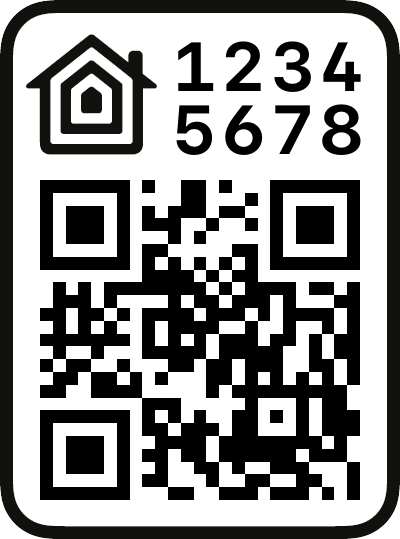

# ESP HomeKit SDK
## 项目基于以下两个仓库修改而来，方便开发和自定义设备
[esp-homekit-sdk](https://github.com/espressif/esp-homekit-sdk)

[Arduino-HomeKit-ESP8266](https://github.com/Mixiaoxiao/Arduino-HomeKit-ESP8266)

# 二维码配对

您可以使用二维码与配件配对。要启用该功能，需要配置`password`并设置`setupId`

```c
homekit_server_config_t config = {
    .accessories = accessories,
    .password = "123-45-678",
    .setupId="1QJ8",
};
```

需要在`homekit/types.h`中找到您在主附件中设置的类别枚举的值:

```c
  HOMEKIT_ACCESSORY(.id=1, .
  category=homekit_accessory_category_lightbulb, .services=
  (homekit_service_t*[]){
```

`homekit_accessory_category_lightbulb` 参数就是需要设置的设备类型 

二维码生成脚本需要 Python 环境、需要提前配置好环境、安装第三方库 ：
```
pip3 install pillow
```

然后，执行脚本生成二维码：
```
qrcode/gen_qrcode 5 123-45-678 1QJ8 qrcode.png
```

